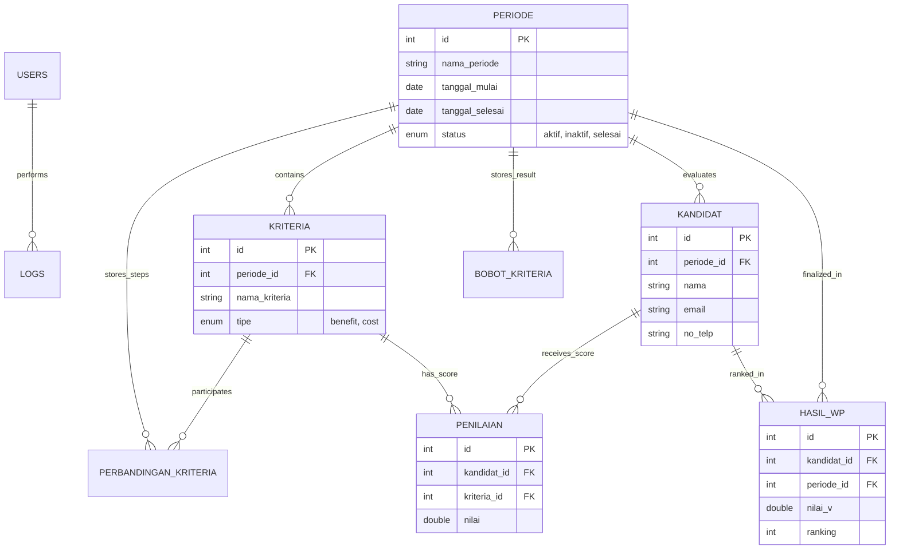

# 🗄️ Database Architecture

Sistem ini dirancang menggunakan basis data relasional MySQL dengan integritas data yang ketat. Semua data operasional terikat pada entitas **Periode** untuk memastikan pemisahan data antar gelombang seleksi.

## Entity Relationship Diagram (ERD)

## Tabel Konfigurasi Detail

| Tabel | Deskripsi | Field Utama |
| :--- | :--- | :--- |
| **`periode`** | Inti dari pemisahan data. | `nama_periode`, `status`, `range_tanggal` |
| **`kriteria`** | Parameter penilaian. | `nama_kriteria`, `tipe` (Cost/Benefit) |
| **`perbandingan_kriteria`** | Data matriks berpasangan AHP. | `kriteria_id_1`, `kriteria_id_2`, `nilai` |
| **`bobot_kriteria`** | Hasil normalisasi matriks AHP. | `kriteria_id`, `bobot_prioritas` |
| **`kandidat`** | Data peserta seleksi. | `nama`, `kontak` |
| **`penilaian`** | Matriks keputusan kandidat. | `kandidat_id`, `kriteria_id`, `nilai` |
| **`hasil_wp`** | Hasil akhir perangkingan. | `nilai_v`, `ranking` |

---

> [!NOTE]
> Sistem menggunakan **Foreign Key Constraints** pada tingkat database untuk menjamin jika sebuah Periode dihapus, semua data terkait (Kriteria, Kandidat, Penilaian) akan ikut terhapus secara otomatis (*Cascade Delete*).
