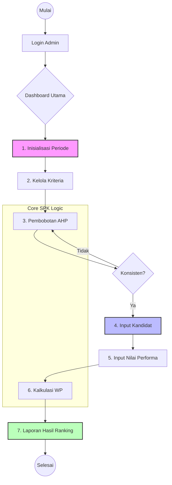

# 🔄 System Workflows

Aplikasi SPK Security beroperasi dalam alur modular yang terintegrasi. Setiap tahap dalam sistem dirancang untuk meminimalisir bias manusia melalui validasi data dan algoritma SPK.

## Peta Proses Utama (Flowchart)

## Penjelasan Tahap Detail

### 1. Inisialisasi & Kriteria
Admin membuat periode seleksi baru. Data kriteria (seperti Tinggi Badan, Pengalaman, Tes Fisik) ditentukan bersama tipenya:
- **Benefit**: Semakin besar nilai semakin baik.
- **Cost**: Semakin kecil nilai semakin baik.

### 2. Analytical Hierarchy Process (AHP)
Tahap krusial untuk menentukan **Bobot Prioritas**. Admin membandingkan kepentingan antar kriteria (Pairwise Comparison). Sistem menghitung *Consistency Ratio* (CR) secara otomatis untuk menjamin validitas perbandingan.

### 3. Evaluasi & Weighted Product (WP)
Setiap kandidat dinilai pada matriks keputusan. Algoritma WP melakukan normalisasi bobot dan menghitung nilai preferensi (Vektor V).

### 4. Pelaporan
Sistem mengurutkan nilai V dari tertinggi ke terendah sebagai dasar keputusan penerimaan petugas keamanan. Laporan dapat diekspor ke PDF untuk arsip resmi.

---

> [!TIP]
> Anda dapat memantau progres setiap tahap secara real-time melalui bar navigasi pada aplikasi yang akan berubah status saat data prasyarat telah terpenuhi.
